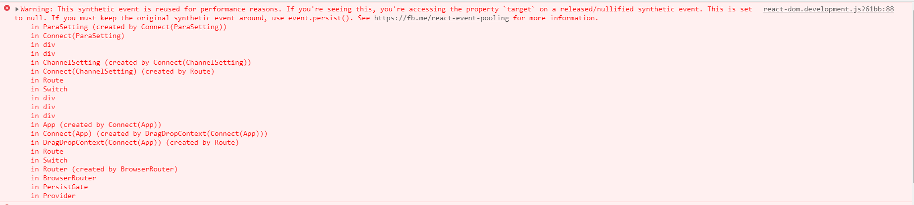

## 1. invalid value for prop on <td> tag either remove it from the element, or ...

解决方式&原因： 参照 antd 官方 demo，只在 edit 为 true 时触发 oncell，td 未非编辑状态时不必传参；

_tips: react antd table 20191217_

## 2. monitor-chart 组件在本机外曲线等不刷新；

解决方式&原因： 服务启动机器与访问页面机器时间不对应；代码中判断时间差大于一定频率才刷新；

_tips: 基础 算法 canvas chart 20191224_

## 3. react 引入 html 方法及编码错误乱码

解决方式&原因：

```
<iframe
    <!-- onLoad={() => {
		const obj = ReactDOM.findDOMNode(this);
		this.setState({
			"iFrameHeight":  obj.contentWindow.document.body.scrollHeight + 'px'
		});
    }}
    ref="iframe"
    src="/courses.html"
    width="100%"
    height={this.state.iFrameHeight}
    scrolling="no"
    frameBorder="0" -->
	title='resg'
	srcDoc={userManual}
	style={{width:'100%',boder:0,height:'100%'}}
	sandbox="allow-same-origin allow-scripts allow-popups allow-forms"
	scrolling="auto"
            />
```

乱码：vs 切换至 gb2313 保存，再切换回 utf-8，保存；

_tips:react iframe html 乱码 编码错误 20191231_

## 4. antd table 固定列样式问题

解决方式&原因： column 中 fixed 列添加 width 属性

_tips: antd table 20191231_

## 5. sha-xx 对不上

解决方式&原因：npm i npm -g // 升级 npm 版本

_tips: npm sha-xxx_

## 6. npm i electron 失败

原因：网不行；electron_mirror 配置不对；
解决方式： 1.拷贝 zip、txt 至路径：c:\users\xx\appdata\local\electron\cache
2.npm config set electron_mirror "http://xxx"

_tips: electron npm_

## 7. TypeError：Cannot read property 'match' of undefined

解决方式&原因：npm cache clean -f; 删除 package-lock.json

_tips: npm_

## 8. 接口调用不到服务

解决方式&原因：[webpack 代理](https://webpack.docschina.org/configuration/dev-server/#devserver-proxy)

```
module.exports = {
  //...
  devServer: {
    proxy: {
      '/api': 'http://localhost:3000',
    },
	proxy: {
      '/api': {
        target: 'http://localhost:3000',
        bypass: function(req, res, proxyOptions) {
          if (req.headers.accept.indexOf('html') !== -1) {
            console.log('Skipping proxy for browser request.');
            return '/index.html';
          }
        }
      }
    },
	proxy: [{
      context: ['/auth', '/api'],
      target: 'http://localhost:3000',
    },{
      context: ['/variableManager'],
      target: 'ws://localhost:3000', // socketIO 代理
    }]
  }
}
```

_tips: webpack 代理_

## 9. objects are not valid as a react child

解决方式&原因：treeData 数据中有<span>标签，导致数据被判为 obj，删除相关标签，用字符串代替

_tips: react 数据_

## 10. webpack 打包 内存溢出

解决方式：

1. 用全局配置的 webpack 发布时，修改全局的 webpack.cmd 中 node 后面添加参数 --max_old_space_size=2048 或者更大（我没试过）
2. 用局部的 webpack 发布时，修改本地的./node_modules/.bin/webpack.cmd node 后面添加参数 --max_old_space_size=2048 或者更大
3. bc 前端 webpack 打包内存溢出以前出现过，因为 build 的时候用了--process --color --ode production，现在 BC 前端不报错是因为把 webpack 后面的参数去掉了，如果加上，应该也同样会报内存溢出的错误
4. 模块按需引入；
5. 删除多余的 npm 包

_tips: webpack 打包 内存溢出_

## 11. node-gyp 环境搭建

设置环境变量：NODEJS_ORG_MIRROR=http://repo.hirain.net/...../node-dist/
先全局安装 node-gyp, npm install node-gyp
再安装 gyp 头文件， node-gyp install
还有一个环境变量也设置上：IOJS_ORG_MIRROR=http://repo...../iojs/

_tips: node-gyp 环境搭建_

## 12. 启动 node 程序报错:event.js:183 throw er; // unhandled 'error' event

- 原因：端口被占用
- 解决方式：
  1. 找到占用端口的进程
  ```
  lsof -i:端口号  // 输出：command:进程名称  pid:进程标识符
  netstat -tunlp|grep 端口号 // 输出末尾 22283/node 表示占用端口的进程标识符合进程名称
  ```
  2. 杀掉进程
  ```
  kill -9 PID
  ```
  3. 重启服务

_通过取消 webpack devserver port 配置后，系统可自动分配端口_
_tips:webpack node 端口_

## 13. webpack 报错：Module parse failed: Unexpected character '�' (1:0)

- 原因：缺少或 url-loader 、 file-loader 配置不完善
- 解决方式：引入相关 loader

_处理后需要重启 webpack_
_tips:webpack loader_

## 14. must call getfieldprops with valid name string

- 原因：引用重复（引用中有 e ， 与方法中 e 冲突）
- 解决方式： 改掉冲突的 e 的名称
  _tips:重复引用 import_

## 15. Uncaught (in promise)

- 原因：promise 写法有问题
- 解决方式： 在后面加上.catch((e) => {})
  ```
  return new Promise((resolve, reject) => {
     console.log
    }).catch((e) => {})
  ```
  _tips: Promise catch_

## 16. webpack devServer proxy 配置不生效

原因： webpack proxy 配置，只转发 localhost:8080 的数据,其他端口的数据并不进行代理操作
解决办法：将 fetch 请求的头部改为"localhost:8080"或"/"
_tips: webpack devServer proxy 代理_

## 17. this.setState()里取不到 event.target.value



- 解决办法：调用 event.persist()综合事件会将事件从池中删除，从而允许异步保留对事件的引用。
- 参考： [react 事件重用](https://medium.com/trabe/react-syntheticevent-reuse-889cd52981b6)

_tips: react event.persist()_

## 18. first-child 伪类权重影响 > 子集样式

- 错误写法：
  

- 正确写法：
  

_tips: less 权重 > 伪类 :first-child_
